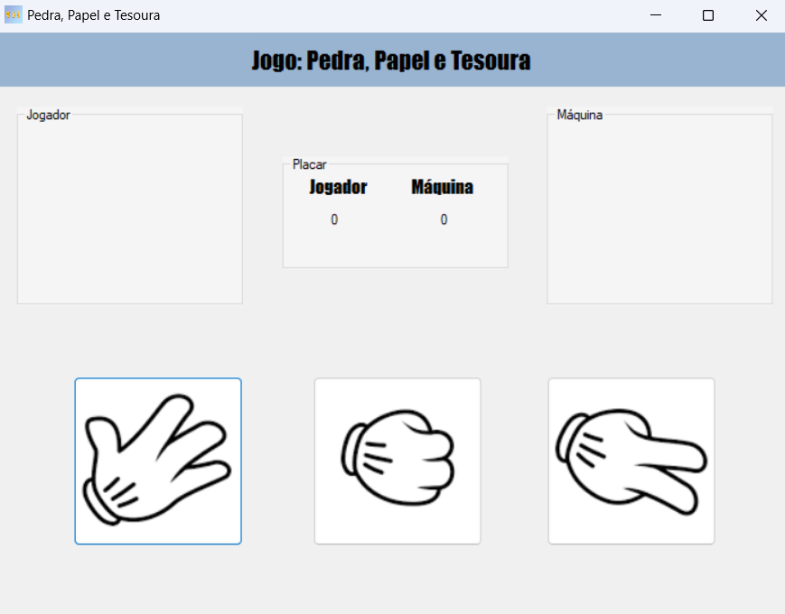

<h1 align="center"> Jogo C# - Pedra Papel Tesoura</h1>

Projeto de C# Criado durante o Curso Desenvolvimento de Sistemas na Etec Albert Einstein.

---

 

  

---
## 💻 Tecnologias

Esse projeto foi desenvolvido com as seguintes tecnologias:

- C#
- Visual Studio
- Git e Github

---

## 🚧 Projeto

Jogo criado em C#, onde o Player joga contra a Máquina, tendo de escolher entre Pedra, Papel e Tesoura. Quem chegar a 3 primeiro ganha. Aplicativo criado durante o curso Desenvolvimento de Sistemas pela Etec Albert Einstein.

Para Ver e Testar esse Projeto você precisa baixar e rodar no Visual Studio.

--- 
